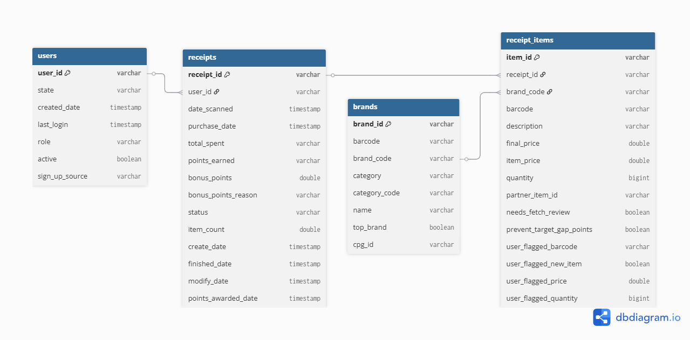

# Fetch Coding Exercise

## How to Use (For Interviewers/Evaluators)

This package was created as part of an interview exercise to demonstrate SQL and Python data engineering skills. Please focus your evaluation on the `notebook.ipynb` file, which provides a complete, step-by-step workflow:

- **Data Loading:** Loads unstructured JSON data into DuckDB, simulating a data warehouse environment.
- **Data Cleaning & Modeling:** Transforms and cleans the data, building normalized tables.
- **Analysis & Business Questions:** Runs SQL queries to answer business questions and demonstrate analytical capabilities.
- **Data Quality Checks:** Includes data validation and quality analysis.

**Instructions:**
1. Open `notebook.ipynb` in Jupyter or your preferred notebook viewer.
2. Follow the notebook flow from top to bottom—each cell is documented and builds on the previous steps.
3. The notebook is self-contained and will demonstrate:
   - Data ingestion
   - Data cleaning
   - Data modeling
   - Analytical SQL
   - Data quality assessment
   - Business insights


---


## Data Sources
- **users.json**: User account information (496 records)
- **brands.json**: Brand/product information (1,168 records) 
- **receipts.json**: Receipt scanning data (2.3MB file)

## 1. Structured Relational Data Model

### Entity-Relationship Diagram (ERD)



---

## Environment Setup

To run the code or the notebook, set up a Python virtual environment and install dependencies:

```sh
python -m venv venv
# On Windows:
venv\Scripts\activate
# On Mac/Linux:
source venv/bin/activate
pip install -r requirements.txt
```

- All required dependencies (including DuckDB) are listed in `requirements.txt`.
- To launch the notebook:
  ```sh
  jupyter notebook notebook.ipynb
  ```
- If you need to install Jupyter:
  ```sh
  pip install jupyter
  ```
- The code is compatible with Python 3.8+.


---

